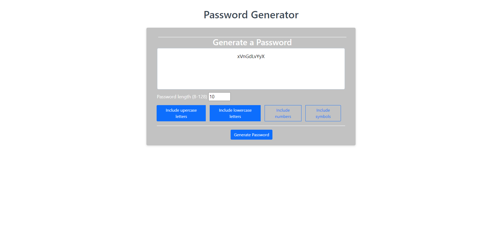

# Password Generator

## Need a password? 

This is an easy to use password generator that allows you to create a password from 8-128 characters with options to include, at minimum 1 option, uppercase letters, lowercase letters, numbers, and special characters!

Below I have a screenshots of the application.

## Instructions

- select the length of your password from 8-128 characters.
- select 1 or more of the password parameters(lowercase, upppercase, numbers, symbols)
- hit the "Generate password button!

## Usage
This is a simple responsive sight and has
 -css
 -html
 -bootstrap
 -javascript

## Credits
Credit to [Mike Fearnley](https://michaelfearnley.com/) and [Scott Byers](https://github.com/switch120)

as well as [Traversy Media](https://www.youtube.com/channel/UC29ju8bIPH5as8OGnQzwJyA) youtube channel.

and the UNH Fullstack Coding Bootcamp

## Links 
Here is the link to the deployed site: https://taylorgonz.github.io/password-generator/
## Contact

if you want to contact me for any more questions here are my links!

hello@taylorgonz.com
 
[Website](http://www.taylorgonz.com)

## Licensing
 [General Public License](https://opensource.org/licenses/GPL-2.0)
